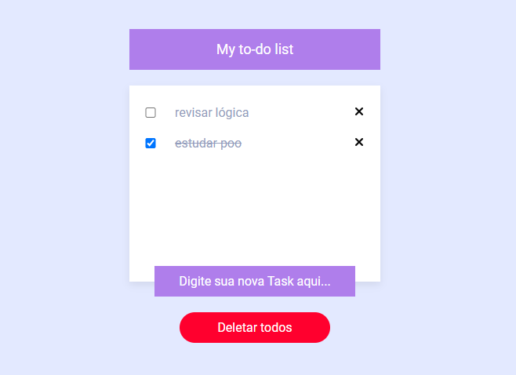

# Primeiro Projeto prático de Angular

Projeto realizado para praticar alguns conceitos novos que aprendi durante o estudo do framework Angular.

 

<br/>

<a href="https://angular-projeto1.vercel.app/">
📍 Deploy 
<a/>

## Alguns Conceitos práticados:
- Funcionamento dos componentes no angular, desde sua criação até em como é sua comunicação entre eles
- Utilização de Template Data Binding principalmente do ngModel para atualizar valores simultaneamente
- Lógica da comunicação de componentes atráves do principalmente do @Output
- Utilização de algumas diretivas como ngClass, ngIf e ngFor

## Instalação

Para instalar e executar este projeto localmente, você precisará ter o Node.js e o Angular CLI instalados em seu ambiente de desenvolvimento. 
Depois de configurar o ambiente, siga estas etapas:
<br/><br/>
1- Clone este repositório ou se preferir baixar o zip do projeto:
```bash
git clone https://github.com/seuusuario/seuprojeto.git
````

2- Após baixado ou clonado o projeto é necessário extrair a pasta do projeto e dentro dela abrir o prompt

3 -Instalar as dependências do projeto usando o npm via terminal:
```bash
npm install
````

4 - Por fim inicie o servidor de desenvolvimento (certifique de ter instalado o Angular CLI na máquina):
```bash
ng serve
````


